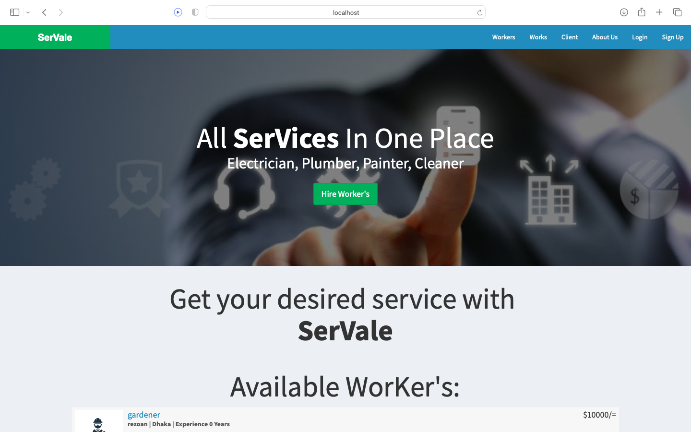
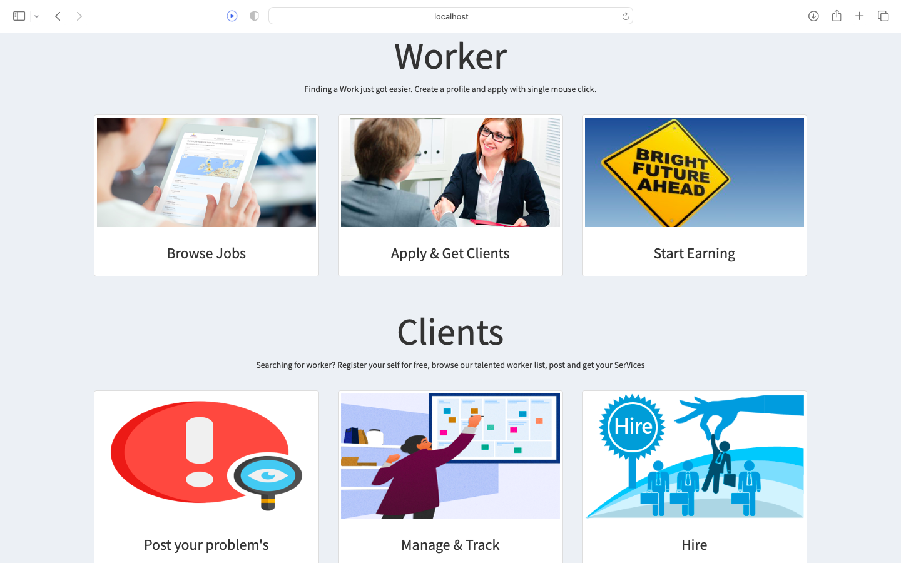
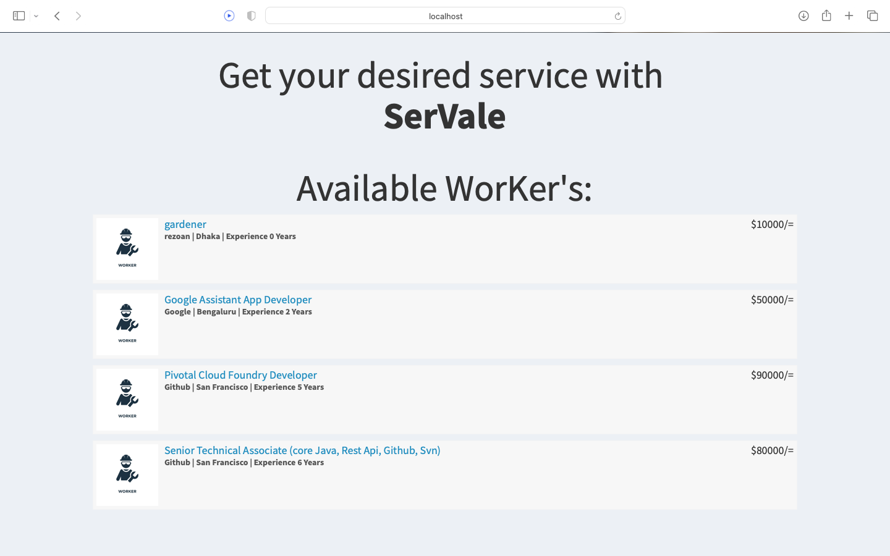
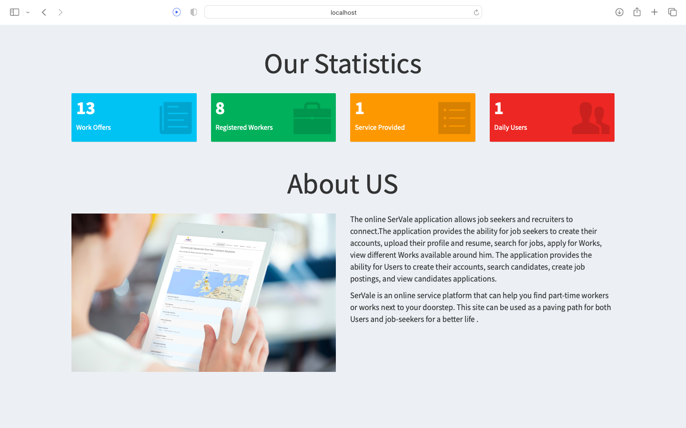
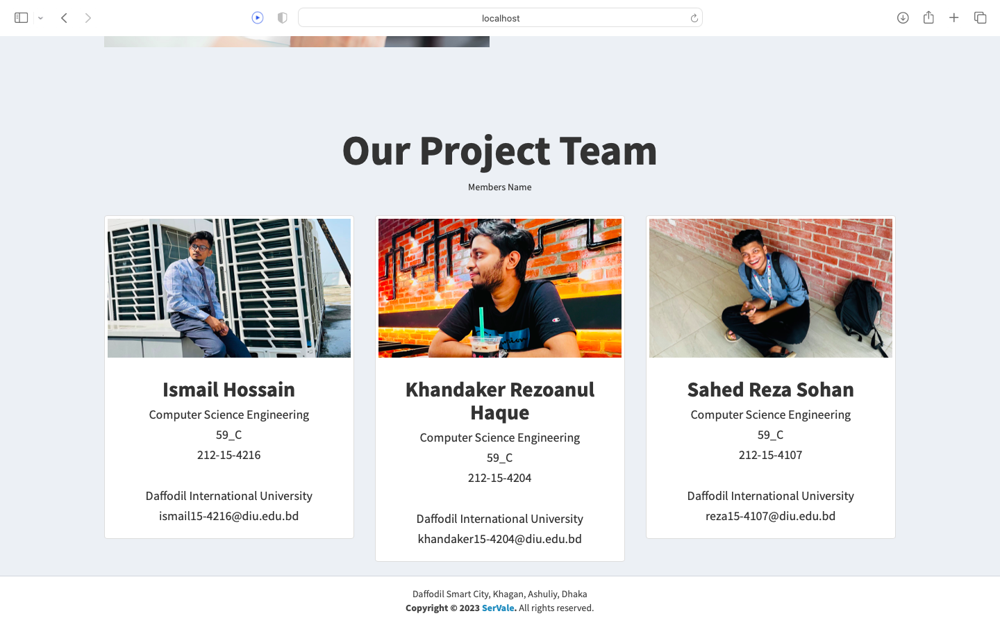
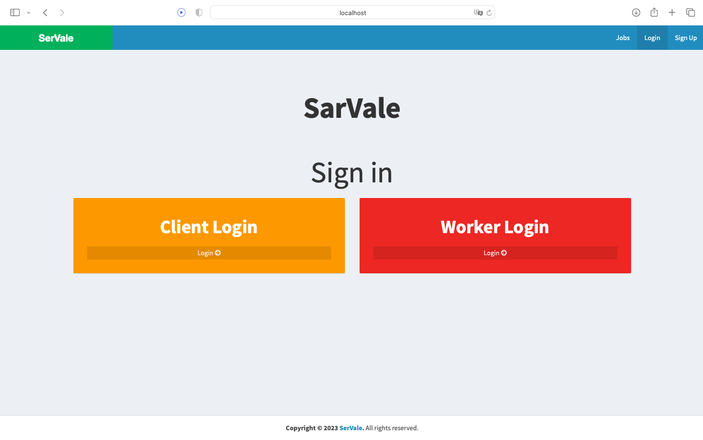
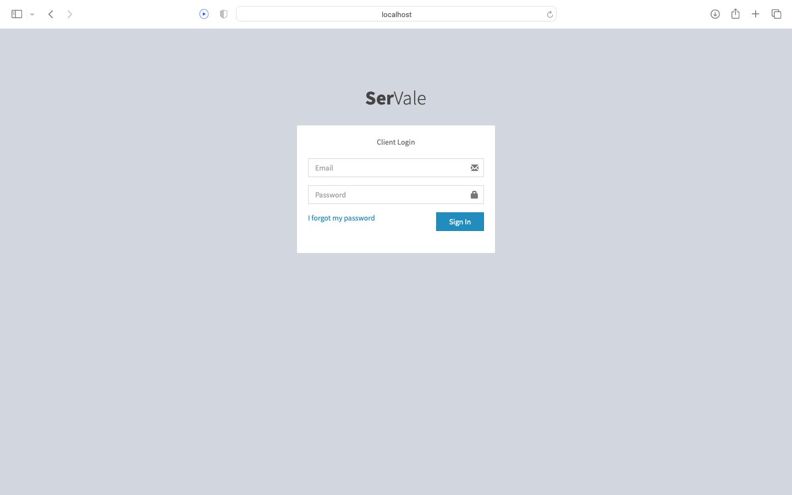
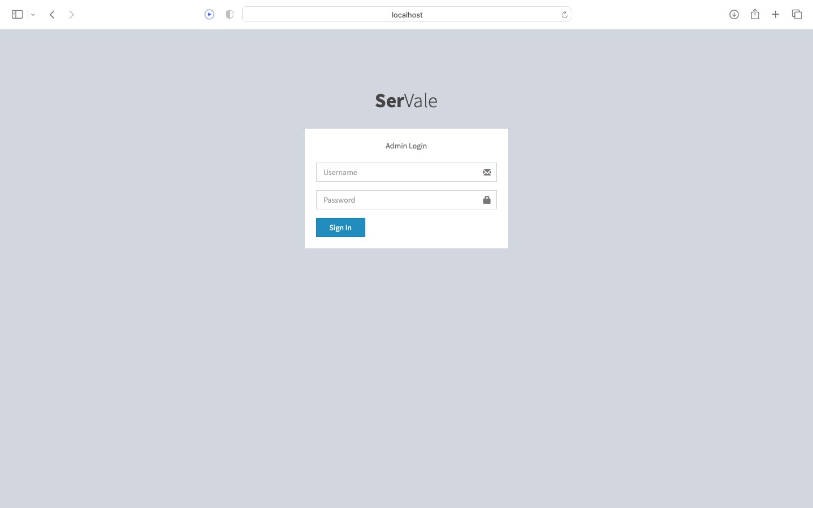
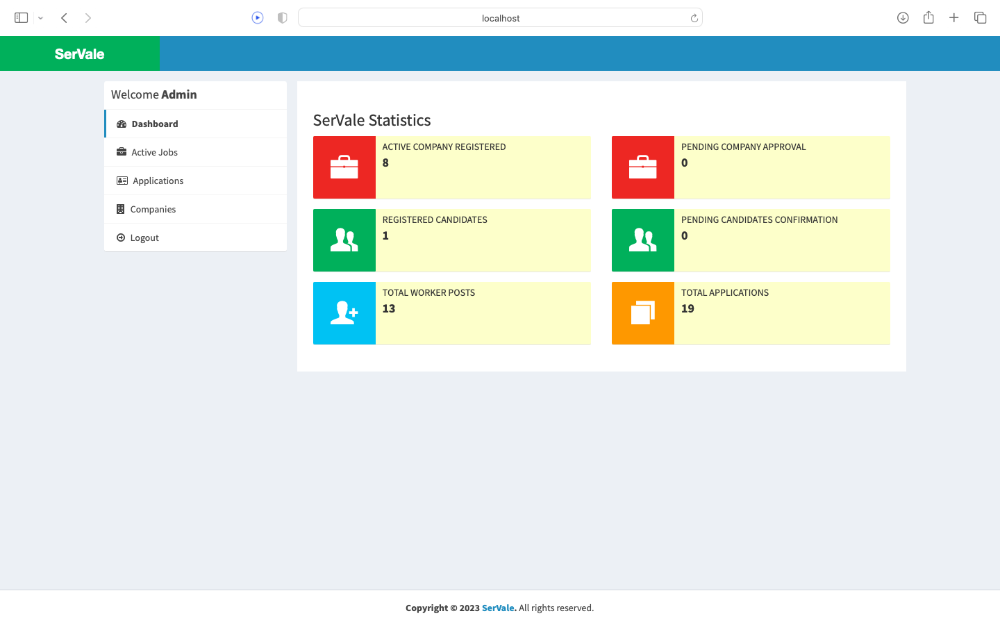

# SerVale by Rezoan Khandaker

Made with Core PHP and Bootstrap CSS Framework. 🤍

## Run Locally

Clone the project

```bash
  git clone https://github.com/rezoankh/Servale-v2.git
```

import the git_repos_jobportal.sql in the xampp mysql database.


Paste the SerVale code in htdocs folder. (found in WAMPP, XAMMP, MAMPP installation folder)

Start the Apache and Mysql services from the MAMPP server (mac), XAMPP server (windows).

```bash
  cd SerVale
```

Open db.php

Check the credentials for username and password are matching according to your system.

Goto ```localhost``` and you will see job posts.

Login to apply to job 

## Login Credentials

username: admin  password: 12345

Candidates default login

username: m@m.com  password: m

## Home Page











## Candidates can login and apply for various jobs, Update their information, Email recruiters etc.

## These website use session cookies for proper account management and provides security for the portal
